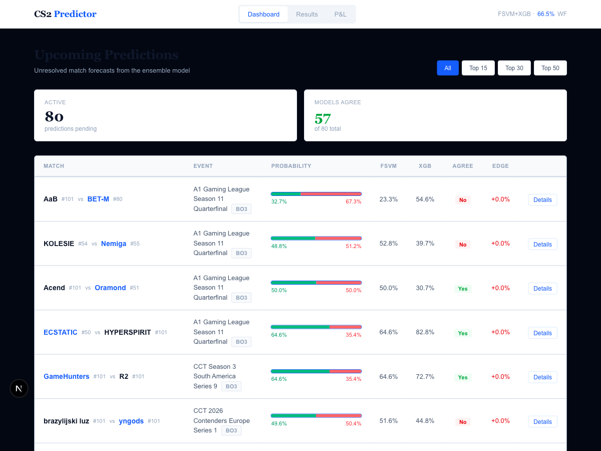
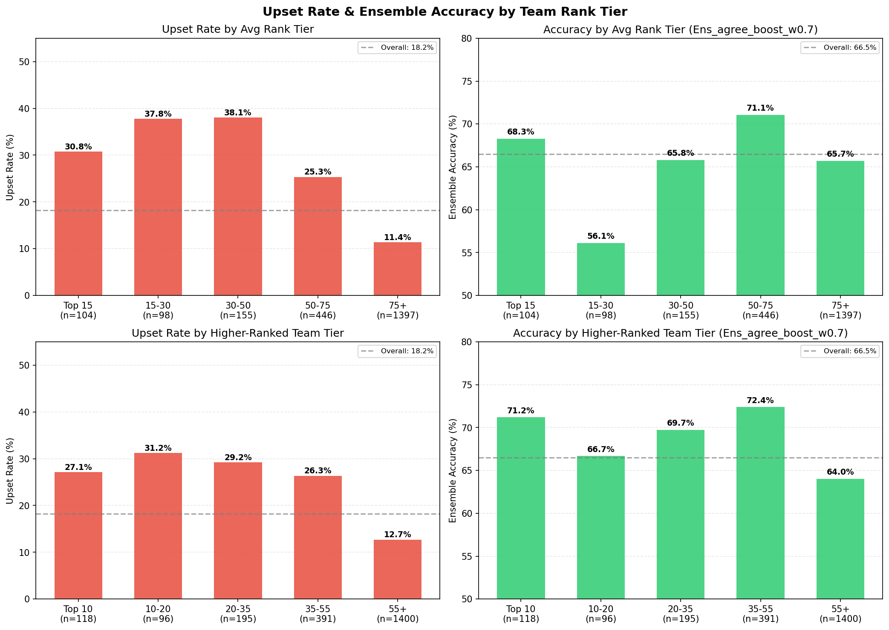
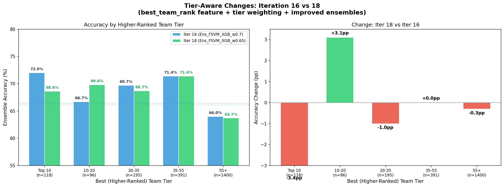

# CS2 Predictor: Machine Learning for Counter-Strike 2 Match Prediction

## Overview

CS2 Predictor is a machine learning system that predicts professional Counter-Strike 2 match outcomes using a hybrid **Fuzzy Support Vector Machine (FSVM) + XGBoost** ensemble. The system scrapes match data from HLTV.org, engineers 47 features across eight statistical tracking domains, and evaluates predictions using strict walk-forward validation.

The project achieves **66.50% walk-forward accuracy** with a **+6.55% edge** over a rank-only baseline — statistically significant at the 95% confidence level (bootstrap CI: [64.5%, 68.5%]). Throughout this writeup, **edge** refers to the percentage-point improvement in accuracy over the naive rank baseline (i.e., always predicting the higher-ranked team to win). A positive edge means the model is extracting predictive signal beyond what team ranking alone provides.



---

## Motivation & Background

This project draws inspiration from the approach outlined in *"Machine learning approaches to predict basketball game outcome"* (Horvat & Job, 2018), published in the *International Journal of Computer Science in Sport*, which systematically reviews ML techniques for sports outcome prediction. The paper highlights how SVMs and ensemble methods can outperform traditional statistical models when provided with sufficiently rich feature sets — particularly when temporal patterns and team dynamics are captured. In particular we borrow the approach using a Fuzzy Support Vector Machine (which introduces fuzzy membership of inputs, which ultimately allows for more flexible class membership weighting — which becomes particularly useful for solving a SVM problem with multiple dimensions and bases, like esports data.)
Original Paper: https://ieeexplore.ieee.org/document/991432

CS2 esports presents a uniquely data-rich environment for applying these ideas. Unlike traditional sports with seasonal schedules and limited games, professional CS2 teams compete in dozens of matches per month across international tournaments. HLTV.org — the definitive stat tracker for competitive Counter-Strike — provides granular data at the player, map, and round level. This created an opportunity to build feature sets far richer than what's typically available in traditional sports prediction: per-player kill/death ratios, ADR (average damage per round), KAST percentages, pistol round win rates, map pool depth, veto patterns, and more.

The core insight from the basketball prediction literature — that ensemble methods combining complementary model strengths outperform any single model — proved directly applicable. FSVM and XGBoost exhibit deeply complementary error patterns in CS2 prediction, which the ensemble exploits.

---

## The Dataset

All data was scraped from HLTV.org across multiple scraping phases using Playwright and Chrome DevTools Protocol (CDP) to bypass Cloudflare protections.

| Dataset | Records | Coverage |
|:--------|--------:|:---------|
| Match results | 6,000 | All top-100 team matches |
| Match detail pages | 6,000 | 100% |
| Player statistics | 74,979 | 4,839 unique players |
| Map-level player stats | 133,470 | Per-map breakdowns |
| Half scores | 7,296 | CT/T side splits |
| Veto data | 15,858 | Map pick/ban sequences |
| Pistol round results | 3,808 | Round 1 & 13 outcomes |
| Rankings history | 2,907 | 29 weekly snapshots (Jul 2025 - Feb 2026) |
| Map results | 3,818 | From 1,608 matches |

From this raw data, we engineer a set of derived features **eight real-time statistical trackers** that replay the full match history chronologically to reconstruct the state of the competitive landscape at any point in time:

1. **Elo System** (K=32) — Dynamic rating with momentum tracking
2. **Form Tracker** — 10-match rolling win rate and streaks
3. **Head-to-Head Tracker** — Historical matchup records
4. **Player Stats Tracker** — Per-player rolling K/D, ADR, KAST, rating (10-match window)
5. **Map Stats Tracker** — Map pool depth and win rates (20-match window)
6. **Pistol Tracker** — Pistol round win rates (30-match window)
7. **Chemistry Tracker** — Pairwise roster tenure (days played together)
8. **Upset Detector** — Internal logistic regression predicting P(upset), retrained every 100 matches

The player and individual team performances can be depenendent on recent form, team chemistry, play/team momentum and many other factors - which we construct in the above feature set. 

---

## Feature Engineering

The richness of available CS2 data enabled a 47-feature "lean" set organized across several domains:

| Domain | Features | Examples |
|:-------|:--------:|:--------|
| Elo & Ranking | 8 | `elo_diff`, `rank_diff`, `dyn_rank_diff`, `log_rank_ratio` |
| Form & Momentum | 3 | `form_diff`, `momentum_diff`, `vs_strong_diff` |
| Head-to-Head | 2 | `h2h_winrate`, `h2h_matches` |
| Map Pool | 2 | `map_pool_depth_diff`, `map_wr_overlap` |
| Rank Volatility | 5 | `rank_vol_diff`, `rank_trajectory_diff`, `rank_confidence` |
| Player Stats | 11 | `diff_avg_rating`, `diff_avg_adr`, `diff_avg_kast`, `diff_chemistry`, `diff_roster_exp` |
| Match Format | 4 | `is_bo1`, `is_bo3`, `is_bo5`, `home_diff` |
| Interactions | 6 | `rank_diff_x_bo`, `elo_diff_x_form`, `momentum_x_form` |
| Advanced | 4 | `upset_prob`, `upset_prob_x_rank_diff`, `map_upset_potential`, `pistol_wr_diff` |

The single largest accuracy gain in the project (+1.36 percentage points) came from expanding player data coverage from 27% to 94% of matches in Iteration 14. Features like roster experience and team chemistry — which had been defaulting to zero for most matches — suddenly became top SHAP features in model disagreement analysis. This underscores how critical data completeness is: the same features went from useless to dominant simply by filling in missing values with real data.

---

## Model Architecture

### Fuzzy SVM

The Fuzzy SVM is based on the formulation by Lin & Wang (2002), which extends the standard SVM by assigning each training sample a membership value *s_i* in (0, 1]:

```
minimize  (1/2)||w||^2 + C * SUM(s_i * xi_i)
```

where *xi_i* is the slack variable for sample *i* and *s_i* controls how much that sample's misclassification penalty contributes to the objective. Samples with low membership are effectively treated as less important — their constraint violations cost less. This is implemented via scikit-learn's `SVC.fit(sample_weight=s)`, using an RBF kernel (`C=1.0`, `gamma='scale'`).

Four membership strategies were implemented and evaluated:

- **Time decay**: `s_i = exp(-lambda * age)` — recent matches weighted exponentially higher (`lambda=0.001`, `sigma_floor=0.1`)
- **Class center**: `s_i = 1 - (d_i / max(d))` — distance from class centroid in feature space
- **Confidence**: KNN-based entropy — ambiguous samples near the decision boundary down-weighted
- **Hybrid**: `s_i = s_time * s_center` — multiplicative combination (`alpha=0.5`)

The **time decay** strategy proved most effective, achieving **65.50% walk-forward accuracy** — the best single-model result. This aligns with the intuition that CS2's competitive landscape shifts rapidly as teams roster-swap, change form, and adapt to meta shifts. Older matches become less predictive over time. Critically, FSVM with time decay also exhibited the **lowest temporal variance** of any model tested (window std: 2.14%), meaning its predictions are the most stable across different time periods.

**FSVM configuration**: `C=1.0, kernel='rbf', gamma='scale', lambda_decay=0.001, sigma_floor=0.1`

### XGBoost

A gradient-boosted tree ensemble with regularization:

```
max_depth=5, learning_rate=0.01, n_estimators=200
colsample_bytree=0.8, subsample=0.8
```

Walk-forward accuracy: **64.86%** (+4.91% edge). Notably, XGBoost exhibited a **negative train-WF gap** (-1.75%) — its walk-forward accuracy *exceeded* its mean training accuracy — indicating strong generalization rather than memorization. Deeper tree variants (depth 10, 15, 20) were explored in Iterations 12-13 and improved test-split accuracy by up to +1.83pp, but provided negligible walk-forward improvement (+0.05pp), confirming they overfit to temporal patterns that don't generalize forward. The grid search correctly identified `max_depth=5` as optimal.

Additional external sample weighting (`decay=0.985`) further prioritizes recent matches during training for both models.

### Ensemble: Agreement-Boosted Blend

Confusion matrix analysis revealed deeply complementary error patterns between the two models:

| Scenario | FSVM Accuracy | XGB Accuracy |
|:---------|:------------:|:------------:|
| Expected outcomes (favorite wins) | **80.0%** | 74.7% |
| Upsets (underdog wins) | 29.7% | **40.6%** |
| Large rank gaps (30-60 diff) | **69.2%** | 65.1% |
| BO3 format | **65.9%** | 64.6% |
| BO1 / BO5 format | Lower | **Higher** |
| Low-confidence predictions | **56.1%** | 53.9% |
| High-confidence predictions | Lower | **Higher** |
| Both models agree (79.5% of matches) | **75.4%** | — |

FSVM dominates on predictable, expected outcomes — when the favorite wins, especially with large rank gaps in BO3 format. XGBoost dominates on upsets and high-confidence edge cases. The models agree 79.5% of the time (349 of 439 test samples), and when they agree, accuracy jumps to **75.4%**.

The production ensemble uses an **agreement-boosted** strategy:
- When both models agree on the winner: trust the prediction (use FSVM's probability)
- When they disagree: blend probabilities at `0.7 * FSVM_prob + 0.3 * XGB_prob`

This achieves **66.50% walk-forward accuracy** with **+6.55% edge** — the best result across all 19 iterations.

---

## The Upset Problem

CS2 has a high inherent upset rate: approximately **39%** of matches are won by the lower-ranked team. This creates a hard ceiling on any rank-based prediction strategy — a naive "always pick the favorite" approach caps out around 61%.

The model's approach to upsets is layered. The internal **Upset Detector** — a logistic regression (`C=0.1`) trained on non-rank features and retrained every 100 matches (minimum 200 samples) — generates an `upset_prob` feature that feeds into both main models. SHAP disagreement analysis shows `upset_prob` as a top feature for XGBoost in both correct and incorrect disagreements, suggesting the model uses it as a meaningful signal even if it can't perfectly discriminate. XGBoost correctly predicts **40.6%** of upsets versus FSVM's 29.7% — a meaningful gap given the difficulty of the task.



---

## Evaluation: Walk-Forward Validation

All accuracy numbers use strict **walk-forward validation** — the gold standard for time-series prediction:

- **Window size**: 200 matches
- **Start index**: 3,600 (allowing tracker warmup on earlier data)
- **Test samples**: 2,200
- **Method**: Train on all data up to time *t*, predict the next match, advance by 1, repeat
- **Bootstrap CIs**: 10,000 resamples

This prevents any future information from leaking into predictions and provides honest, deployment-realistic accuracy estimates.

### Full Results Table

| Iter | Features | Best Model | Test Acc | Test LogLoss | WF Best | WF Edge | 95% CI | Rank Baseline | Notes |
|-----:|---------:|:-----------|:--------:|:------------:|:-------:|:-------:|:------:|:-------------:|:------|
| 1 | 15 | XGBoost | 59.39% | 0.7051 | - | - | - | 61.21% (static) | Baseline Elo/rank/form/H2H |
| 2 | 51 | LogisticRegression | 58.79% | 0.6847 | - | - | - | 60.91% (static) | Added player stats, roster, rest days |
| 3 | 51 | XGB_tuned_lean | 60.30% | 0.6850 | - | - | - | 60.91% (static) | Lean feature set + XGB grid search |
| 5 | 56 | LR_L1_C0.01 | 63.33% | 0.6611 | - | - | - | 60.91% (static) | Heavy regularization |
| 7 | 64 | LR_minimal | 66.58% | 0.6056 | 61.02% | +1.68% | - | 59.34% (WF dyn) | 6K matches, scaler leak fix |
| 8 | 72 | XGB_lean | 65.00% | 0.6252 | 60.36% | -0.16% | - | 60.52% (WF dyn) | Dynamic ranks + map features |
| 10 | 75 | XGB_tuned_lean | 64.17% | 0.6275 | 62.55% | +2.60% | - | 59.95% (WF dyn) | Deeper trees, multi-model WF |
| 11 | 82 | XGB_tuned_lean | 64.17% | 0.6262 | 63.23% | +3.27% | - | 59.95% (WF dyn) | Rank volatility + upset detector |
| 13 | 83 | XGB_lean_d15 | 65.00% | 0.7208 | 63.50% | +3.55% | - | 59.95% (WF dyn) | Pistol round win rate feature |
| 14 | 83 | XGB_tuned_lean | 66.50% | 0.6105 | 64.86% | +4.91% | - | 59.95% (WF dyn) | Full player data (94% coverage) |
| 15 | 83 | XGB_tuned_lean | 66.50% | 0.6105 | 65.50% | +5.55% | - | 59.95% (WF dyn) | Fuzzy SVM breakthrough |
| 16 | 83 | XGB_tuned_lean | 66.50% | 0.6105 | 65.50% | +5.55% | [63.5, 67.5] | 59.95% (WF dyn) | Overfit diagnostics |
| 18 | 84 | XGB_tuned_lean | 66.58% | 0.6102 | 65.55% | +5.60% | [63.6, 67.6] | 59.95% (WF dyn) | Tier weighting (reverted) |
| **19** | **83** | **XGB_tuned_lean** | **66.50%** | **0.6105** | **65.50%** | **+5.55%** | **[63.5, 67.5]** | **59.95% (WF dyn)** | **Agree-boost ensemble** |

### Walk-Forward Ensemble Progression

| Iter | Best Ensemble | WF Acc | WF Edge | 95% CI |
|-----:|:--------------|:------:|:-------:|:------:|
| 10 | Ens_rank_blend_a0.2 | 63.05% | +3.10% | - |
| 11 | Ens_rank_blend_a0.1 | 64.36% | +4.41% | - |
| 14 | Ens_rank_blend_a0.1 | 65.36% | +5.41% | - |
| 15 | Ens_FSVM_XGB_w0.7 | **66.36%** | **+6.41%** | **[64.4, 68.3]** |
| 18 | Ens_FSVM_XGB_w0.65 | 66.05% | +6.10% | [64.0, 68.0] |
| **19** | **Ens_agree_boost_w0.7** | **66.50%** | **+6.55%** | **[64.5, 68.5]** |

The ensemble progression tells a clear story: rank-based blending carried performance from Iterations 10-14, but the FSVM/XGB probability blend in Iteration 15 was the breakthrough (+1.00pp over previous best). The agreement-boost refinement in Iteration 19 added another +0.14pp by learning *when* to trust the models jointly versus blending.

### Overfit Diagnostics (Iteration 16)

A critical question: are these results real, or are we overfitting? The table below provides the answer.

| Model | Train Acc | WF Acc | Train-WF Gap | Window Std | 95% CI | SV Ratio | vs Rank CI |
|:------|:---------:|:------:|:------------:|:----------:|:------:|:--------:|:-----------|
| XGB_tuned_lean | 63.11% | 64.86% | **-1.75%** | 3.85% | [62.9, 66.9] | - | SEPARATED (+0.86pp) |
| XGB_lean_d15 | 64.51% | 63.32% | +1.19% | 3.83% | [61.3, 65.3] | - | overlaps |
| LGBM_lean_d6 | 63.02% | 63.73% | -0.71% | 3.00% | [61.8, 65.8] | - | overlaps |
| FSVM_time_lean | 67.35% | 65.50% | +1.85% | **2.14%** | [63.5, 67.5] | 81.4% | SEPARATED (+1.50pp) |
| Ens_FSVM_XGB_w0.7 | - | 66.36% | - | - | [64.4, 68.3] | - | SEPARATED (+2.41pp) |
| Rank baseline | - | 59.95% | - | - | [57.9, 62.0] | - | - |

Key findings:
- **FSVM is NOT overfit**: Train-WF gap of +1.85% is modest, and its window std of 2.14% is the lowest of any model — the most temporally stable predictions.
- **XGBoost generalizes well**: Negative train-WF gap (-1.75%) means walk-forward accuracy *exceeds* training accuracy.
- **The ensemble is statistically significant**: CI lower bound (64.4%) is **2.41pp above** the rank baseline CI upper bound (62.0%). This is not chance.
- **Deeper trees don't generalize**: XGB_lean_d15 and LGBM_lean_d6 CIs overlap with the rank baseline — their test-set gains are illusory.
- **FSVM's 81.4% support vector ratio** is high but expected for RBF kernels on noisy data. The kernel implicitly regularizes via the margin, and time-decay membership further down-weights older noisy samples.

### Tier-Level Performance

Model accuracy varies significantly by competitive level:

| Tier | Matches | Ensemble Accuracy |
|:-----|:-------:|:--------:|
| Top 10 | 118 | **71.2%** |
| Rank 10-20 | 96 | 66.7% |
| Rank 20-35 | 195 | **69.7%** |
| Rank 35-55 | 391 | **72.4%** |
| Rank 55+ | 1,400 | 64.0% |
| **Elite combined (rank < 55)** | **800** | **70.9%** |

The model performs best on elite matches (rank < 55) at **70.9%** — where team form, player skill, and map pool data are richest and most predictive. The Rank 35-55 tier actually outperforms Top 10, possibly because mid-tier teams have more predictable patterns and fewer meta-breaking roster changes.



### Tier-Specialized Models (Iteration 19)

An attempt to exploit these tier differences by training separate models per tier:

| Model | All Samples | Own Tier | N (own tier) |
|:------|:----------:|:--------:|:------------:|
| FSVM_elite (rank < 55) | 65.82% | **70.00%** | 800 |
| XGB_elite (rank < 55) | 62.09% | 66.87% | 800 |
| FSVM_lower (rank >= 55) | 63.05% | 63.14% | 1,400 |
| XGB_lower (rank >= 55) | 62.68% | 60.00% | 1,400 |
| Best TierSpec ensemble | **65.59%** | - | 2,200 |

FSVM_elite achieves **70.00%** accuracy on elite-tier matches alone — a strong signal. But the tier-specialized ensemble (65.59%) fell short of the global ensemble (66.50%). The problem: training on tier subsets reduces data per model (~36% for elite), hurting generalization despite better tier-specific fit. The global model with implicit tier awareness (via rank features and interactions) outperforms explicit tier splitting.


**Note on tiered model for future research:**

That being said this ought to be explored in future iterations - we can train using flexible and overlapping tier bands (since the teams move across the tiers over time regardless), to expand the data set in a way that's feasible. For the time being  - we leave the fixed band approach for later. 

---

## Key Findings

1. **Fuzzy SVM's time-decay membership is uniquely suited to esports** — the competitive landscape shifts faster than traditional sports, making recency weighting critical. FSVM showed the lowest temporal variance (2.14% window std) of all models tested, and its formulation directly addresses the problem of older, less-relevant training data polluting the decision boundary.

2. **Player-level data was the single biggest unlock** — expanding from 27% to 94% coverage produced a +1.36pp walk-forward lift (Iteration 14), the largest single-iteration gain. Roster experience and team chemistry went from invisible to top SHAP features overnight. The same mathematical features went from noise to signal simply through data completeness.

3. **Ensemble complementarity is real and measurable** — FSVM dominates on expected outcomes (80% accuracy), XGBoost dominates on upsets (40.6%). These are not slightly different models — they have fundamentally different error modes, which is exactly what makes their combination powerful. When they agree (79.5% of matches), accuracy reaches 75.4%.

4. **The ~39% upset rate sets a hard ceiling** — any rank-aware predictor is bounded at ~61%. The 66.50% result represents a +6.55% edge over this ceiling, capturing most of the exploitable structure in the available feature space. The remaining 3.5pp to the 70% target likely requires fundamentally new data sources (demo reviews, in-game economy data, real-time player communication patterns).

5. **Tier-specialized models are a data trap** — training separate models for elite vs. lower-tier matches reduces training data per model, hurting generalization. A global ensemble with implicit tier awareness (via rank features) outperforms explicit tier splitting. However, the **70% accuracy on elite matches** represents a strong signal for tier-aware *betting strategies* (i.e., using a single global model but only acting on its predictions for elite-tier matches).

6. **Deeper trees overfit temporally** — deeper XGBoost variants (d10, d15, d20) improve test-split accuracy by up to +1.83pp but provide negligible walk-forward improvement. They memorize temporal patterns in the training window that don't persist forward. Walk-forward validation is essential for honest evaluation; test-split results are misleading.

7. **Simple beats complex — until it doesn't** — Logistic Regression with 9 features outperformed all models through Iteration 7. It wasn't until Iteration 10+ that XGBoost with richer features began to consistently beat both LR and the rank baseline in walk-forward. The lesson: added complexity only pays off once data richness and feature quality cross a threshold.

---

## Future Work

- **Live odds integration**: Real-time bookmaker odds for automated edge detection and Kelly criterion bet sizing
- **Demo/VOD analysis**: Extract round-level economy and utility usage patterns from game replays
- **Transfer learning**: Pre-train on CS:GO historical data (10+ years of matches) and fine-tune on CS2
- **Real-time tracker updates**: Stream match results into the tracker state without full replay (~60s startup)
- **Temporal ensemble weighting**: Dynamically adjust the FSVM/XGB blend ratio based on recent model performance windows

---

*Built with Python, scikit-learn, XGBoost, and an unhealthy amount of HLTV scraping.*
